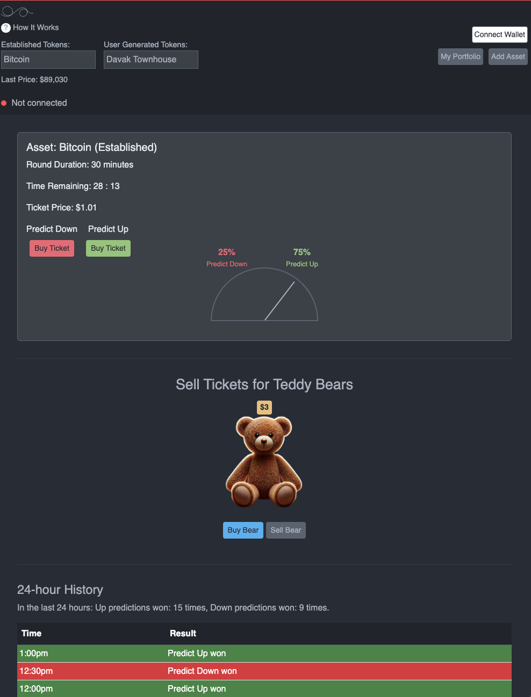

# Ampable

### AMP Tokenized Asset Prediction Platform As A Ticketed On-Chain Game +  On-Chain Regulatory Platform Supporting the Assurance Market Protocol

## Introduction

Ampable is two things:

- A game whereby users can buy tickets (for example for $5 USDC) and receive rewards (for example NFTs) for predicting whether an asset will reach a certain price by a certain date. This can be for tokenized RWA tokens or traditional tokens like wBTC or WETH. Futhermore, these rewarded NFTs that are earned for correct predictions can be sold at market prices. In the example below, the tickets are 5 USDC, and the reward for tickets bought by winning gamers is a NFT bear that can itself be bought or sold for $10. Additionally, users can launch tokens themselves for play in the game. When users launch tokens tied to real-world assets that others can buy on platforms like Uniswap and predict in-game for, the On-Chain Regulatory Platform is necessary to ensure that the appropriate disclosures are made about those assets, as to strive towards a constantly improving. more universal regulatory adherence.

- An on-chain, AI-driven regulatory framework built for open marketplaces with vested-interest assurance voting that brings the concept of the Assurance Market Protocol (AMP) into the modern decentralized finance (DeFi) landscape. Originally conceptualized in 2017, AMP allowed participants to engage in prediction markets based on real-world asset outcomes. Ampable updates this concept for today's regulatory environment, integrating on-chain compliance and real-time regulatory insights powered by advanced AI systems to facilitate secure and lawful transactions involving real-world assets.


### User Interface Example of the Ampable Game:




## Decentralized Cloud Hosting and GenAI API Key Management

Ampable leverages decentralized cloud computing and advanced AI technologies to provide real-time regulatory information in a secure and trustless manner. This section outlines how Ampable manages API keys securely using Shamir's Secret Sharing, utilizes the Akash Network for decentralized computation, and integrates with Chainlink oracles for reliable data transmission.

### Secure API Key Management with Shamir's Secret Sharing

To ensure the security and privacy of API keys used for accessing AI services like OpenAI's GPT models, Ampable implements **Shamir's Secret Sharing**:

- **Distributed Key Management**: API keys are split into multiple parts (shares) using Shamir's Secret Sharing algorithm.
- **Threshold Scheme**: A minimum of **20 nodes** is required to reconstruct the original API key, enhancing security against unauthorized access.
- **Decentralized Storage**: Each share is stored on a different node within the network, preventing any single point of failure or compromise.
- **Collusion Resistance**: The requirement of multiple nodes to access the API key mitigates the risk of collusion among malicious actors.

### Decentralized Compute with the Akash Network

Ampable utilizes the **Akash Network**, a decentralized cloud computing marketplace, to run its AI-powered regulatory compliance services:

- **Decentralized Hosting**: Node.js applications that interact with AI models are hosted across multiple providers on the Akash Network (Currently exploring various options as Akash is still early).
- **Scalability**: The network's open marketplace allows for dynamic scaling based on computational demand.
- **Cost Efficiency**: Competitive bidding among providers ensures cost-effective resource utilization.
- **Continuous Operation**: Smart contracts facilitate automatic renewal and payment for services, ensuring uninterrupted access to regulatory information.

### Integration with Chainlink Oracles

To securely transmit data between the decentralized compute layer and the Ethereum blockchain, Ampable integrates with **Chainlink oracles**:

- **Reliable Data Transmission**: Chainlink oracles enable smart contracts on Ethereum to receive off-chain data from the Akash-hosted AI services.
- **DAO-Governed Validators**: The **DAO votes on approved Chainlink nodes** (validators) to ensure data integrity and prevent malicious actors.
- **Tamper-Proof Mechanism**: Chainlink's decentralized network of oracles provides a tamper-resistant method for fetching and delivering data.

### Necessity of Decentralized Compute for AI Calls

Running the AI services on a decentralized network is crucial for:

- **Trustlessness**: Eliminates reliance on centralized entities, aligning with blockchain principles.
- **Resilience**: Enhances fault tolerance and reduces the risk of service outages or censorship.
- **Privacy and Security**: Distributes computational tasks, minimizing the exposure of sensitive data like API keys.

### AI-Generated Regulatory Information Workflow

1. **User Interaction**:
   - Users initiate a transaction that requires regulatory compliance checks.
   - Before proceeding, they are informed about the need to obtain regulatory information.

2. **Request Processing**:
   - The DApp sends a request to the decentralized AI service hosted on the Akash Network.
   - **Cost Mechanism**: Users must pay a fee to prevent Distributed Denial-of-Service (DDoS) attacks and to cover computational expenses.

3. **AI Response**:
   - The **GPT-based AI models** process the request and generate a regulatory compliance report.
   - The AI is trained to output responses in **JSON format** for compatibility.

4. **Data Transmission via Oracle**:
   - The JSON response is sent back to the Ethereum smart contract through Chainlink oracles.
   - Ensures secure and verifiable data delivery.

5. **User Acknowledgment**:
   - Users receive the regulatory information within the DApp interface.
   - They must **digitally sign** to acknowledge that they have reviewed the compliance report before the transaction proceeds.
   - This acknowledgment is recorded on-chain for transparency and accountability.

### Developer Guidelines and Workflow Transparency

- **Public AI Training Models**: The training data and models for the AI are made publicly available.
- **Developer Empowerment**: DApp developers can integrate the workflow into their applications and opt to use their own OpenAI API keys if preferred.
- **Cost Awareness**: By exposing the workflow, developers and users understand the costs involved in obtaining regulatory information.
- **Preventing Abuse**: The requirement of payment for AI requests deters spamming and misuse of resources.

### Handling Information Variance and User Awareness

- **Dynamic Information**: Regulatory data may vary over time due to changes in laws and regulations.
- **User Notification**: Users are informed that regulatory information is subject to change and may differ between the time of request and transaction submission.
- **On-Chain Record**: The specific regulatory information provided to the user is recorded on-chain, ensuring transparency and providing a reference for future audits.

### Summary

By integrating decentralized cloud hosting, secure API key management, and reliable oracle services, Ampable ensures that users have access to accurate and timely regulatory information in a trustless environment. The combination of these technologies upholds the platform's commitment to compliance, security, and decentralization, bridging the gap between real-world regulatory requirements and the decentralized finance ecosystem.


 -----------------


## Key Features

- **Assurance Market Protocol Integration**: Engage in prediction markets where you can stake on the success or failure of asset thresholds defined by issuers.
- **Advanced AI Compliance Systems**: Utilize dual AI components for real-time regulatory checks and output verification.
- **On-Chain Regulatory Compliance**: Smart contracts incorporate regulatory checks, ensuring all transactions comply with local and international laws.
- **Oracle Integration**: Access up-to-date regulatory information and asset data through oracles connected to AI systems.
- **Decentralized Governance (DAO)**: A decentralized autonomous organization oversees protocol updates, approves trusted data sources, and works to obtain regulatory permissions.

## How It Works

### 1. Asset Listing

Issuers list assets on Ampable, defining success and failure thresholds.

For example:

- A property development must be completed and sold by a specific date.
- A project must reach a funding goal within a set timeframe.

### 2. Prediction Market Engagement

Participants can:

- **Stake Digital Assets on Outcomes**: Speculating with tokens on whether the asset will meet the defined threshold (Yes/No).
- **Assess Risk**: View the aggregate stakes to gauge community perception of the asset's risk.

### 3. Tokenized Real World Asset Purchase Opportunities

Based on risk assessments, participants may choose to:

- **Purchase Asset Tokens**: Acquire tokens issued by the asset issuer, representing a stake in the asset.
- **Speculate With or Without Purchasing Asset Tokens**: Stake digital assets against the asset's success to potentially earn returns if the asset fails to meet its threshold.

### 4. Regulatory Compliance Checks

Before executing any transaction:

- **User Verification**: Smart contracts prompt users to declare their country of residence and other relevant information. This is further clarified in the **Definitions** below.

### Definitions of Key Components and Concepts

#### AI-Driven Analysis

An AI system, similar to OpenAI's ChatGPT, searches the internet for the most current laws and regulations based on the user's declared location and transaction details.

#### Flagging System

- **Red Flags**: Indicate severe regulatory issues that could lead to legal consequences.
- **Yellow Flags**: Warn of potential regulatory concerns that should be reviewed.
- **Output Verification**: A secondary AI system, akin to Google's Gemini, performs a red-team check on the regulatory feedback to ensure accuracy and reliability.

#### Acknowledgment and Proceeding

- **User Decision**: Users receive the flagged information and must acknowledge it to proceed with the transaction.
- **Proceeding with Caution**: Users can still proceed, but transactions with red flags are noted for further review.

#### Reporting Mechanism

- **DAO Oversight**: The DAO monitors transactions that proceed despite red flags.
- **Regulatory Reporting**: Such transactions are reported to relevant authorities for investigation, helping regulators oversee potentially improper activities.

### 5. Outcome Resolution

- **Success**: If the asset meets the threshold, participants who purchased asset tokens receive returns as per the asset's terms.
- **Failure**: If the asset fails, participants who staked against it receive the staked funds, providing a safety net.

## Regulatory Compliance Mechanism

Ampable ensures compliance through an integrated system:

### Dual AI Components

- **Internet-Connected AI**:
  - **Function**: Searches for up-to-date laws and regulations relevant to the user's location and transaction.
  - **Output**: Provides real-time regulatory feedback with red and yellow flags.
- **Red Team AI**:
  - **Function**: Performs a secondary check on the initial AI's output to ensure accuracy and compliance.
  - **Platform**: Utilizes advanced models similar to Google's Gemini.

### Flagging System

- **Red Flags**:
  - **Definition**: Severe regulatory issues that could result in legal penalties.
  - **Action**: Transactions can proceed but are reported for investigation.
- **Yellow Flags**:
  - **Definition**: Potential regulatory concerns or warnings.
  - **Action**: Users are advised to review but can proceed without immediate reporting.

### Reporting and Transparency

- **On-Chain Reporting**:
  - **Transparency**: All transactions, including those with flags, are recorded on-chain.
  - **DAO Monitoring**: The DAO reviews flagged transactions for potential action.
- **Regulatory Collaboration**:
  - **Assistance to Authorities**: Ampable aids regulators by providing information on potentially improper transactions.
  - **User Awareness**: Users are made aware that proceeding with flagged transactions may lead to regulatory scrutiny.

### Updating Approvals and Compliance

#### DAO Role in Compliance

- **Regulatory Approvals**: The DAO actively works to obtain necessary permissions from various regulatory authorities.
- **Smart Contract Updates**: Contracts are updated to reflect new approvals and compliance statuses.

### AI Integration

- **Dynamic Updates**: AI systems read updated smart contracts to provide accurate regulatory feedback.
- **Localized Compliance**: Users receive information tailored to their specific jurisdictions, acknowledging new approvals.

## Limitations and Acknowledgments

- **AI Limitations**:
  - **Imperfect Systems**: The AI components, while advanced, are not infallible and may not capture every regulatory nuance.
  - **Continuous Learning**: Systems are updated regularly to improve accuracy.
- **Regulatory Fluidity**:
  - **Changing Laws**: Regulations can change rapidly; users should stay informed beyond the platform's notifications.
  - **User Responsibility**: Users must exercise due diligence and are responsible for their compliance with local laws.
- **Permissionless Environment**:
  - **Decentralization**: Ampable operates on a decentralized, permissionless blockchain, allowing freedom of participation.
  - **Regulatory Balance**: The platform seeks to balance decentralization with regulatory compliance and assistance to authorities.

## Getting Started

### Prerequisites

- **Git**: Ensure you have Git installed on your machine. [Download Git](https://git-scm.com/downloads)
- **Node.js and npm**: Install Node.js and npm for running and building the project. [Download Node.js](https://nodejs.org/)
- **GitHub Account**: You need a GitHub account to fork the repository.

### Fork the Repository

1. **Navigate to the Ampable Repository**: Go to the Ampable GitHub repository at [https://github.com/AMPABLE/ampable](https://github.com/AMPABLE/ampable).
2. **Fork the Repository**: Click on the **"Fork"** button at the top-right corner of the page. This will create a copy of the repository under your GitHub account.

### Clone the Repository

1. **Copy the Repository URL**: On your forked repository page, click the **"Code"** button and copy the URL (HTTPS, SSH, or GitHub CLI).
2. **Open Terminal**: Open your terminal or command prompt.
3. **Clone the Repository**: Run the following command, replacing `<your-repo-url>` with the URL you copied:

   ```bash
   git clone <your-repo-url>
   ```

4. **Navigate to the Project Directory**:

   ```bash
   cd ampable
   ```

### Install Dependencies

Install the necessary packages:

```bash
npm install
```

### Create a New Branch

Create a new branch for your feature or bug fix:

```bash
git checkout -b my-feature-branch
```

### Make Changes

- **Edit Code**: Make the necessary changes to the codebase.
- **Test Changes**: Ensure your changes work as expected and do not break existing functionality.

### Commit and Push Changes

1. **Stage Your Changes**:

   ```bash
   git add .
   ```

2. **Commit Your Changes**:

   ```bash
   git commit -m "Add feature XYZ"
   ```

3. **Push Changes to GitHub**:

   ```bash
   git push origin my-feature-branch
   ```

### Create a Pull Request

1. **Navigate to Your Forked Repository**: Go to your GitHub account and find the forked repository.
2. **Compare & Pull Request**: Click on the **"Compare & pull request"** button next to your recently pushed branch.
3. **Submit Pull Request**:
   - **Title**: Provide a clear and descriptive title for your pull request.
   - **Description**: Describe the changes you've made and why they're necessary.
   - **Submit**: Click **"Create pull request"** to submit it for review.

### Running the Project Locally

- **Start the Development Server**:

  ```bash
  npm start
  ```

- **Open in Browser**: Navigate to `http://localhost:3000` to view the application.

### Syncing Your Fork

If the original Ampable repository has been updated since you forked it, you can sync your fork with the following commands:

```bash
git remote add upstream https://github.com/AMPABLE/ampable.git
git fetch upstream
git checkout main
git merge upstream/main
```

## Contributing

We welcome contributions from the community. Please read our **Contribution Guidelines** to get started.


**License**

**MIT License**

Copyright (c) 2024 Ampable Contributors

Permission is hereby granted, free of charge, to any person obtaining a copy
of this software and associated documentation files (the "Software"), to deal
in the Software without restriction, including without limitation the rights
to use, copy, modify, merge, publish, distribute, sublicense, and/or sell
copies of the Software, and to permit persons to whom the Software is
furnished to do so, subject to the following conditions:

The above copyright notice and this permission notice shall be included in all
copies or substantial portions of the Software.

THE SOFTWARE IS PROVIDED "AS IS", WITHOUT WARRANTY OF ANY KIND, EXPRESS OR IMPLIED, INCLUDING BUT NOT LIMITED TO THE WARRANTIES OF MERCHANTABILITY, FITNESS FOR A PARTICULAR PURPOSE AND NONINFRINGEMENT. IN NO EVENT SHALL THE AUTHORS OR COPYRIGHT HOLDERS BE LIABLE FOR ANY CLAIM, DAMAGES, OR OTHER LIABILITY, WHETHER IN AN ACTION OF CONTRACT, TORT OR OTHERWISE, ARISING FROM, OUT OF OR IN CONNECTION WITH THE SOFTWARE OR THE USE OR OTHER DEALINGS IN THE SOFTWARE.

## Disclaimer

**Early-Stage Development**

This project is an early-stage research and development initiative. The software and related documentation are provided on an "as is" and "as available" basis without warranty of any kind, express or implied.

**No Liability**

The contributors, development team, and affiliates shall not be held liable for any direct, indirect, incidental, special, exemplary, or consequential damages arising out of or in connection with the software or the use or other dealings in the software. Use of the code is at your own risk.

**Subject to Change**

Features, functionalities, and documentation are subject to significant changes as development progresses. There is no guarantee that the current functionalities will remain the same, and future updates may alter or remove existing features.

**Not an Offering**

This project does not constitute an offering of securities or any other regulated financial instruments in any jurisdiction. The tokens or digital assets mentioned are not intended to represent any form of investment contract or security. Participation in the project should not be considered an investment, and no promises of future performance or value are made.

**User Responsibility**

Users are solely responsible for compliance with all applicable laws and regulations, including but not limited to securities laws, financial regulations, and tax obligations. Users should exercise caution and consult with professional legal, financial, and tax advisors before engaging with the project.

**No Warranties**

The project is distributed in the hope that it will be useful, but without any warranty; without even the implied warranty of merchantability, fitness for a particular purpose, or non-infringement.

---

*By interacting with or contributing to this project, you acknowledge that you have read, understood, and agreed to this disclaimer.*

---


## Contact

Please post any questions or comments in **Issues**.

---

*Ampable is committed to creating a secure and compliant environment for decentralized prediction markets and real-world asset tokenization. By integrating advanced AI systems and regulatory compliance on-chain, we aim to bridge the gap between traditional finance and the decentralized world while acknowledging the dynamic nature of global regulations.*

---
