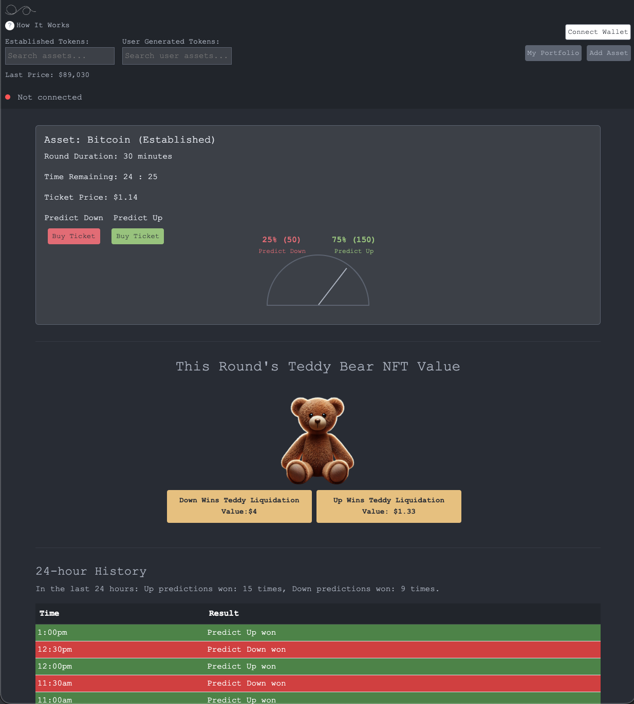

# Ampable

Ampable is an innovative platform built on Arbitrum that reinvents risk assessment for real-world assets. Evolving from the original Assurance Market Protocol (2017), Ampable transforms the idea into a game of skill where participants use their expertise to signal the risk associated with tokenized projects and assets.

> **Note:** Ampable is strictly a game of skill —not a prediction market, gambling platform, or security offering. All game mechanics are designed to reward skill, analysis, and informed decision-making. These features are designed to signal risk to others who are considering potentially taking an interest in a real-world or other type of digital asset on the Arbitrum One or Ethereum network.

---



## Overview

Ampable lets users evaluate the risks of tokenized assets—from gold mines in Indonesia to real estate projects in California—through a skill-based game. By integrating advanced smart contracts, a DAO-led AI regulatory engine, and a dynamic Oracle, Ampable brings together decentralized governance and cutting-edge compliance reporting.

Key highlights:
- **Game of Skill:** The platform focuses on informed decision-making rather than speculation.
- **Evolved Protocol:** Inspired by the original Assurance Market Protocol, Ampable revives its spirit to empower global participants to assess risk.
- **DAO Governance:** A decentralized autonomous organization (DAO) governs key parameters and maintains regulatory oversight.
- **Arbitrum Network:** The platform runs on Arbitrum 1, offering scalability and low transaction fees.
- **AI-Powered Regulatory Reporting:** A smart contract system, supported by a DAO-controlled AI, monitors assets and flags potential regulatory risks.

---

## Folder Structure

Ampable’s repository is organized to help you quickly locate the components you need:

- **contracts/**
  Contains all smart contracts, including:
  - **Core game contracts**
  - **DAO contracts and governance parameters**
  - **Regulatory reporting contracts** – smart contracts that report on all assets and facilitate public regulatory review
  - **Token burning contracts** – enabling the exchange of legacy tokens (from the original Assurance Market Protocol) for new DAO tokens

- **website/**
  Houses the front-end code:
  - **Demo:** Accessible at `website/demo` (requires connection to Arbitrum 1)
  - **Main UI:** For full platform interaction and asset exploration

---

## Regulatory & Compliance Reporting

To uphold our duty of care, Ampable incorporates an advanced regulatory reporting system:

- **AI-Driven Monitoring:**
  A Node.js server—initially hosted on the Akash network—is maintained by the DAO. This server runs an AI engine (currently based on a 400-billion-parameter version of Olama) pre-trained with prompts centered on various popular regulatory regimes. Its role is to analyze asset documentation and community votes, and then flag potential issues.

- **Flagging System:**
  Assets are evaluated and assigned a risk flag:
  - **Green Flag:** Indicates that, based on available documentation or community feedback, there are no glaring issues.
  - **Yellow Flag:** Signals caution—there may be concerns that warrant further investigation.
  - **Red Flag:** Denotes significant issues (e.g., missing contact information or other red flags) that are automatically reported to regulators via the smart contract.

- **Transparency and Public Access:**
  All flagged information is available to regulators and the public through the smart contracts. This ensures that both users and regulatory bodies can review why a specific asset received a red, yellow, or green flag. The DAO plays a critical role in maintaining and updating these processes, ensuring compliance and trust.

---

## Game Mechanics & Integration

### Ticketing System

- **Entry Fee:** Tickets start at 1 USDC.
- **Dynamic Pricing:** Ticket prices increase as the asset assessment window nears expiration. Timeframes include:
  - 30 minutes
  - 1 hour
  - 1 day
  - 1 week
  - 1 month
  - 1 year

### Oracle & Pricing

- **Oracle Mechanism:**
  The pricing oracle sources data from Uniswap v4. The default starting price is based on an asset being valued at 10,000 USDC, with DAO-adjustable thresholds reflecting market conditions.

- **DAO Fee:**
  1% of all transactions is allocated to the DAO to support ongoing development, bug bounties, and continuous improvements.

---

## DAO Governance

Ampable’s DAO is central to the platform’s evolution. Its responsibilities include:

- **Parameter Adjustments:**
  Modify Oracle settings, fee percentages, and other game parameters.

- **Token Burn Mechanism:**
  Users can burn eligible legacy tokens (especially those from the original Assurance Market Protocol) to receive DAO tokens. Conversion rates may vary, with preference for long-term community tokens.

- **Community Oversight:**
  Maintain the regulatory reporting system, including the AI server hosted on Akash, and manage bug bounties, educational initiatives, and platform updates.

For more details, refer to the smart contracts in the **contracts/** folder.

---

## Legal Disclaimer

Ampable is a game of skill designed for entertainment and community engagement. It is **not**:
- A security or investment offering
- A prediction market or gambling platform

Participants are solely responsible for their decisions. By using Ampable, you acknowledge that:
- The platform is for skill-based play only.
- There is no promise of financial gain from participation.
- Regulatory reporting measures are in place to ensure a safe and compliant ecosystem.

---

## Getting Started

1. **Clone the Repository:**
   ```bash
   git clone https://github.com/Ampable/Ampable.git
   cd Ampable
   ```

2. **Explore the Contracts and Website:**
   - Review the smart contracts in the **contracts/** folder.
   - Experience the demo at `website/demo` (ensure your wallet is connected to Arbitrum 1).

3. **Join the Community:**
   - Stay updated on DAO proposals and platform improvements. Join the Discord here: [Discord Invite Link](https://discord.gg/TmpyaM34Fn)
   - Contribute to documentation, report bugs, or submit feature requests via GitHub issues.

---

## Final Notes

Ampable is built for a community of skilled players. It embraces the spirit of the original Assurance Market Protocol while addressing modern regulatory and technical challenges. Whether you’re here to assess risk, contribute to community governance, or explore a novel approach to real-world asset evaluation, we invite you to join the journey.

*This README is a living document and will be updated as the project evolves. Feedback and contributions are always welcome.*
